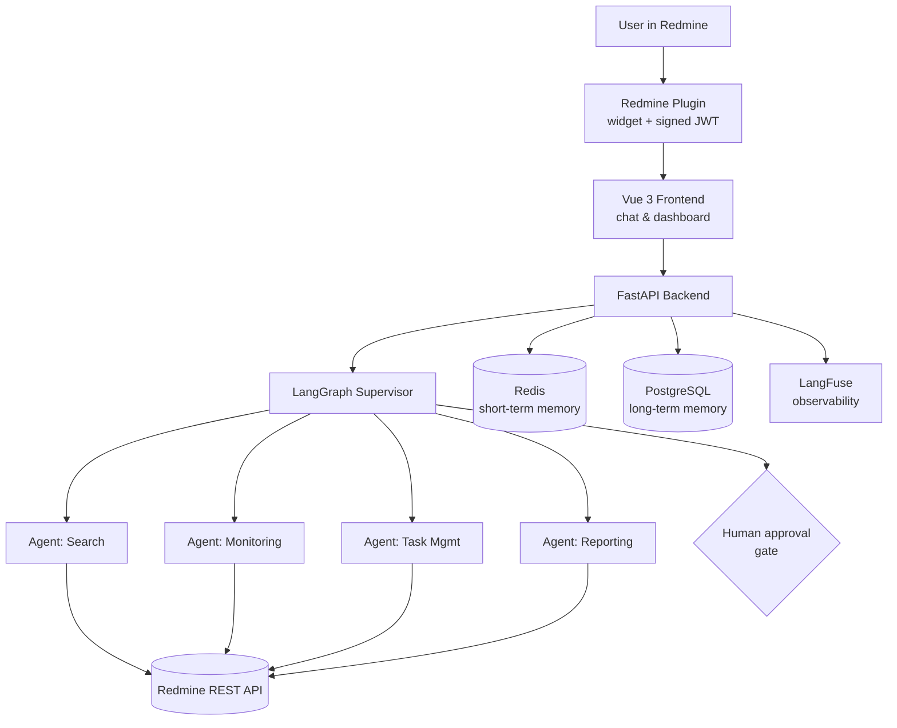

<div align="center">

# 🤖 RedSage

**A multi-agent AI assistant for Redmine project management**

Built on a LangGraph supervisor architecture coordinating four specialized ReAct agents — with human-in-the-loop approval gates, two-tier memory, and full observability.


</div>

---

## What it does

RedSage embeds an AI assistant directly into Redmine to help project managers with day-to-day work: answering questions about project state, triaging issues, and automating routine PM tasks — with a human approving anything that changes real data.

It's a three-part system:

| Part | Role |
|---|---|
| **Backend** (`backend/`) | FastAPI app running the LangGraph agent graph, auth, and Redmine integration |
| **Frontend** (`frontend/redmineAgentUI/`) | Vue 3 + Vite + TypeScript chat and dashboard UI |
| **Redmine plugin** (`plugins/redmine_ai_chat_widget/`) | Embeds the assistant widget directly inside Redmine pages |

## Architecture



**Key design points:**
- 🧠 **Supervisor pattern** — a supervisor routes requests to the right specialized ReAct agent instead of one monolithic prompt
- 🛑 **Human-in-the-loop gates** — any action that mutates Redmine data waits for explicit approval
- 🔧 **14 custom Redmine tools** wrapping the REST API for issues, tasks, and PM workflows
- 🗂️ **Two-tier memory** — Redis for fast short-term context, PostgreSQL for durable long-term memory
- 📊 **Full observability** via LangFuse tracing, background sync jobs via APScheduler
- 🔐 **JWT-based auth** shared across backend, frontend, and the embedded plugin

## Repository layout

```
backend/                         FastAPI backend and agent graph
frontend/redmineAgentUI/         Vue 3 frontend
plugins/redmine_ai_chat_widget/  Redmine plugin (embeds the widget)
scripts/                         Environment verification helpers
docker-compose.yml               Local full-stack setup
Dockerfile                       Backend container image
```

---

## Quick start

### 1. Clone

```bash
git clone https://github.com/AzizK97/RedSage.git
cd RedSage
```

### 2. Backend

```bash
cd backend
cp .env.sample .env   # fill in OPENROUTER_API_KEY, REDMINE_URL, REDMINE_API_KEY, JWT_SECRET, CORS_ORIGINS_*
python -m venv .venv && source .venv/bin/activate
pip install -r requirements.txt
uvicorn app.main:app --reload --host 0.0.0.0 --port 8000
```
API at `http://localhost:8000`, docs at `http://localhost:8000/docs`.

### 3. Frontend

```bash
cd frontend/redmineAgentUI
cp .env.sample .env   # set VITE_API_BASE_URL=http://localhost:8000
pnpm install
pnpm dev
```
UI at `http://localhost:5173`.

### 4. Redmine plugin

```bash
cp -R plugins/redmine_ai_chat_widget /path/to/redmine/plugins/
```
From the Redmine root:
```bash
bundle install
bundle exec rake redmine:plugins:migrate RAILS_ENV=production
```
Restart Redmine, then set `backend_url`, `jwt_secret`, `jwt_issuer`, `jwt_audience` in the plugin's settings page (must match the backend).

**Startup order:** backend → frontend → Redmine (with plugin enabled).

### Or with Docker

```bash
docker-compose up
```
See `DOCKER_README.md` for details.

---

## Troubleshooting

| Symptom | Check |
|---|---|
| Frontend can't reach backend | `VITE_API_BASE_URL` and CORS settings |
| Plugin can't reach backend | `backend_url` and `CORS_ORIGINS_PLUGIN` |
| Auth failures | `JWT_SECRET`, `JWT_ISSUER`, `JWT_AUDIENCE` match across backend and plugin |

Helper scripts: `scripts/verify_env.sh` (Linux/macOS) and `scripts/verify_env.ps1` (Windows).

---

<div align="center">

Built as part of a final-year engineering internship at Elyos Digital · [Contact](mailto:azizkanoun06@gmail.com) · [LinkedIn](https://www.linkedin.com/in/aziz-kanoun)

</div>
