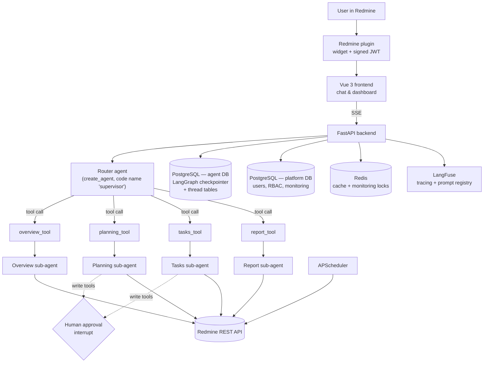

<div align="center">

# 🤖 RedSage

**A multi-agent AI assistant for Redmine project management**

A routing agent delegates to four specialized tool-calling sub-agents that read from and write to Redmine — with human-in-the-loop approval on every write, SSE token streaming, per-thread conversation persistence, and full LangFuse tracing.


</div>

---

## What it does

RedSage embeds an AI assistant directly into Redmine to help project managers with day-to-day work: answering questions about project state, triaging issues, and automating routine PM tasks — with a human approving anything that changes real data.

It's a three-part system:

| Part | Role |
|---|---|
| **Backend** (`backend/`) | FastAPI app running the agent graph, auth, RBAC, Redmine integration, and background monitoring |
| **Frontend** (`frontend/redmineAgentUI/`) | pnpm monorepo — Vue 3 + Vite + TypeScript. `packages/platform` is the app (landing page, chat, dashboard, admin); `packages/api-client` is the shared HTTP client; a widget build target produces the embeddable chat bundle |
| **Redmine plugin** (`plugins/redmine_ai_chat_widget/`) | Rails plugin that injects the chat widget into Redmine pages and passes a signed JWT |

## Architecture



**Key design points:**

- 🧭 **Router-plus-sub-agents, not a handoff supervisor** — the entrypoint is a LangChain `create_agent` (called `supervisor` in the code) whose *tools* are four wrappers (`overview_tool`, `planning_tool`, `tasks_tool`, `report_tool`). Each wrapper synchronously invokes a specialized sub-agent and returns its final message. There is no LangGraph `create_supervisor` and no transfer-back handoff — sub-agents run nested inside a tool call.
- 🤖 **Four specialized sub-agents**, each a tool-calling agent built with `create_agent`:
  - **Overview** — projects, teams, metrics, high-level status *(read-only)*
  - **Planning** — sprints / versions / milestones, including `create_version` and `update_version_dates` *(write)*
  - **Tasks** — issues / tickets: listing, filtering, workload, plus create / update / reassign / comment / date-change / log-time *(write)*
  - **Report** — health reports, KPI summaries, risk synthesis *(read-only)*
- 🛑 **Human-in-the-loop on every write** — `HumanInTheLoopMiddleware` wraps the Planning and Tasks agents; all 8 write tools are registered with `interrupt_on`, so any mutating call pauses the graph and surfaces an approval dialog (`approve` / `reject` / `edit`) before it touches Redmine.
- 🔧 **17 Redmine tools** wrapping the REST API — 9 read (`get_today`, `get_projects`, `get_issues`, `get_all_issues`, `get_issue_detail`, `get_members`, `get_versions`, `get_project_metrics`, `get_all_projects_metrics`) and 8 write (issue create / status / reassign / comment / dates, `log_time`, `create_version`, `update_version_dates`).
- 🔐 **RBAC scoping** — for non-admin users the read tools are restricted to projects where the Redmine user holds a `manager` role; the allowed-project set is resolved from Redmine and cached in Redis.
- 💾 **Persistence, not "two-tier memory"**:
  - **Agent Postgres** (`POSTGRES_URL`) — LangGraph `PostgresSaver` checkpointer holds per-thread conversation state; dedicated `thread_owners` / `thread_messages` tables hold the displayable transcript and pending-interrupt state.
  - **Platform Postgres** (`PLATFORM_POSTGRES_URL`) — users, entitlements, and the monitoring snapshots / events / runs.
  - **Redis** — a cache only: Redmine API responses, RBAC lookups, monitoring run-locks and Slack alert de-duplication. It does **not** store conversation memory.
- 📊 **LangFuse** — request tracing **and** the prompt registry: the supervisor and every sub-agent load their system prompt from LangFuse at startup (`get_prompt(..., label="production")`). LangFuse must be reachable or agent construction fails.
- ⏱️ **Background jobs (APScheduler)** — a PM-sync job refreshes project-manager entitlements; an optional monitoring job snapshots Redmine, diffs against the last run, stores events, and pushes critical/important ones to Slack.
- 📡 **Streaming** — `POST /api/chat/stream` streams supervisor tokens over SSE and emits an `interrupt` event when an approval is required.
- 🧠 **Model** — Ollama via `ChatOllama` (`langchain-ollama`), configured by `LLM_BASE_URL` / `LLM_MODEL`. OpenRouter / Anthropic / Groq wiring exists in the code but is commented out.

## Repository layout

```
backend/                         FastAPI backend and agent graph
  app/agent/supervisor.py        Router agent + SSE streaming + checkpointer
  app/agent/agents/              overview / planning / tasks / report sub-agents
  app/agent/tools/               read.py (9 tools) + write.py (8 tools)
  app/monitoring/                background Redmine monitoring + Slack alerts
  app/api/endpoints/             chat, auth, dashboard, monitoring, search, admin
  alembic/                       platform DB migrations
frontend/redmineAgentUI/         pnpm monorepo (packages/platform, packages/api-client, widget build)
plugins/redmine_ai_chat_widget/  Redmine Rails plugin (embeds the widget)
scripts/                         verify_env.sh / verify_env.ps1 / sync-widget-assets.mjs
k3s/namespace.yaml               namespace stub only (no deployment manifests yet)
docker-compose.yml               provisions Postgres + Redis for local dev
Dockerfile                       backend container image
```

---

## Quick start

### 0. Infrastructure

`docker-compose` only brings up the datastores (Postgres on `5433`, Redis on `6380`) — the backend and frontend run directly on your machine.

```bash
docker-compose up -d          # chatbot-postgres + chatbot-redis
```

You also need a reachable **Redmine** instance with REST API enabled, an **Ollama** endpoint, and a **LangFuse** project (self-hosted or cloud) that contains prompts named `supervisor`, `overview_agent`, `planning_agent`, `tasks_agent`, and `report_agent`.

### 1. Clone

```bash
git clone https://github.com/AzizK97/RedSage.git
cd RedSage
```

### 2. Backend

```bash
cd backend
cp ../.env.example .env        # then edit — see the env table below
python -m venv .venv && source .venv/bin/activate
pip install -r requirements.txt
uvicorn app.main:app --reload --host 0.0.0.0 --port 8000
```

API at `http://localhost:8000`, docs at `http://localhost:8000/docs`. Thread and monitoring tables are created on first use; run `alembic upgrade head` if you want the platform schema migrated explicitly.

### 3. Frontend

```bash
cd frontend/redmineAgentUI
pnpm install
pnpm dev                       # runs the root Vite app
# or: pnpm dev:platform        # runs packages/platform directly
```

Set `VITE_API_BASE_URL` (e.g. in `.env.local`) to the backend URL. Build the embeddable widget with `pnpm build:widget` — output lands in `dist-widget/`, which the backend serves under `/api/static`.

### 4. Redmine plugin

```bash
cp -R plugins/redmine_ai_chat_widget /path/to/redmine/plugins/
```

From the Redmine root:

```bash
bundle install
bundle exec rake redmine:plugins:migrate RAILS_ENV=production
```

Restart Redmine, then set `backend_url`, `jwt_secret`, `jwt_issuer`, and `jwt_audience` in the plugin settings page (they must match the backend).

**Startup order:** datastores → backend → frontend → Redmine (with plugin enabled).

### Environment variables

| Variable | Purpose |
|---|---|
| `POSTGRES_URL` | Agent DB — LangGraph checkpointer + thread tables |
| `PLATFORM_POSTGRES_URL` | Platform DB — users, RBAC, monitoring |
| `REDIS_URL` / `REDIS_HOST` / `REDIS_PORT` | Cache + monitoring locks |
| `REDMINE_URL`, `REDMINE_API_KEY` | Redmine REST API access |
| `LLM_BASE_URL`, `LLM_MODEL` | Ollama endpoint and model |
| `LANGFUSE_PUBLIC_KEY`, `LANGFUSE_SECRET_KEY`, `LANGFUSE_HOST` | Tracing + prompt registry (read by the LangFuse SDK) |
| `JWT_SECRET`, `JWT_ISSUER`, `JWT_AUDIENCE`, `JWT_ALG` | Auth shared with the plugin |
| `CORS_ORIGINS_PLATFORM`, `CORS_ORIGINS_PLUGIN` | Comma-separated allowed origins |
| `PM_SYNC_ENABLED`, `PM_SYNC_INTERVAL_MINUTES` | Project-manager entitlement sync job |
| `ENABLE_MONITORING`, `MONITORING_INTERVAL_SECONDS`, `SLACK_WEBHOOK_URL` | Background monitoring + Slack alerts |

> `.env.example` is a minimal starting point and still references OpenRouter — the running model path is Ollama (`LLM_*`). Adjust accordingly.

---

## Troubleshooting

| Symptom | Check |
|---|---|
| Agent fails to start / prompt errors | LangFuse reachable and the five prompts exist with a `production` label |
| `POSTGRES_URL is not set` | Both `POSTGRES_URL` and `PLATFORM_POSTGRES_URL` are set |
| Frontend can't reach backend | `VITE_API_BASE_URL` and `CORS_ORIGINS_PLATFORM` |
| Plugin can't reach backend | `backend_url` and `CORS_ORIGINS_PLUGIN` |
| Auth failures | `JWT_SECRET` / `JWT_ISSUER` / `JWT_AUDIENCE` match across backend and plugin |
| Model timeouts / empty replies | `LLM_BASE_URL` reachable and `LLM_MODEL` pulled in Ollama |

Helper scripts: `scripts/verify_env.sh` (Linux/macOS) and `scripts/verify_env.ps1` (Windows).

---

<div align="center">

Built as part of a final-year engineering internship at Elyos Digital · [Contact](mailto:zied.kanoun6@gmail.com) · [LinkedIn](https://www.linkedin.com/in/aziz-kanoun)

</div>
